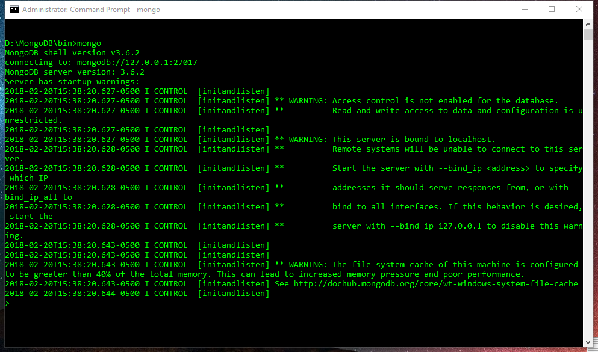

# MongoDB-set-up
MongoDB set-up

Create <strong>data</strong> folder, create <strong>db</strong> folder under data folder.

Create <strong>log</strong> folder

run command prompt by using <strong>administrator</strong> 
Go the the dir of MongoDB,

Config path:
<code>
  mongod --directoryperdb --dbpath D:\MongoDB\data\DB --logpath D:\MongoDB\log\mongo.log --logappend --install
</code>

Start server:
<code>
  net start MongoDB
</code>

Next time,go to the "dir" using <code>mongo</code> to run DB

Check dbs : <code>show dbs</code>

Create dbs: <code>use <bd name></code>
  
Create new users in db:
<code>
  {
  user: "<name>",
  pwd: "<cleartext password>",
  customData: { <any information> },
  roles: [
    { role: "<role>", db: "<database>" } | "<role>",
    ...
  ],
  authenticationRestrictions: [
     {
       clientSource: ["<IP>" | "<CIDR range>", ...]
       serverAddress: ["<IP>" | "<CIDR range>", ...]
     },
     ...
  ]
}
</code>
